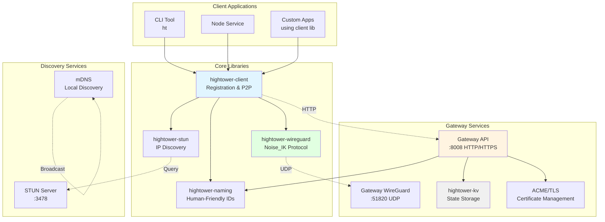
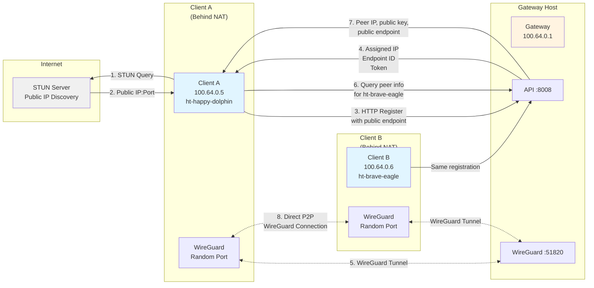
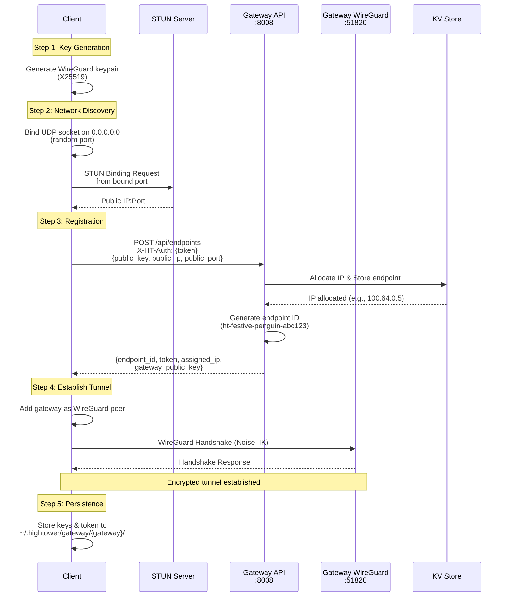
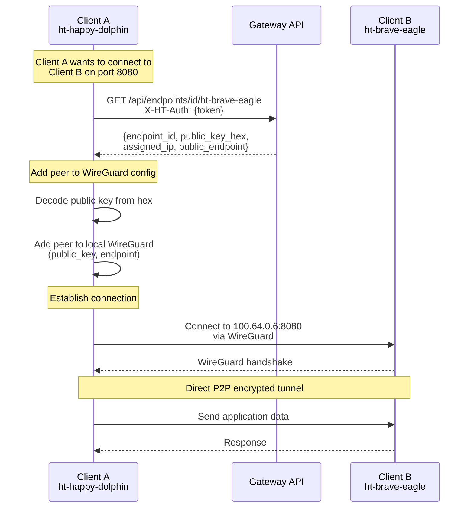
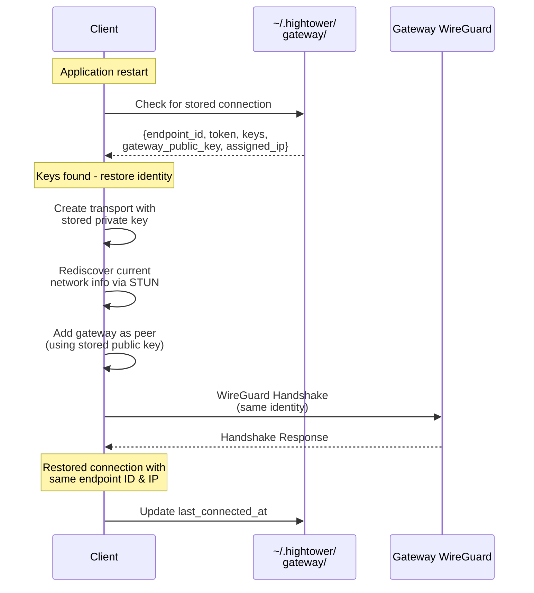
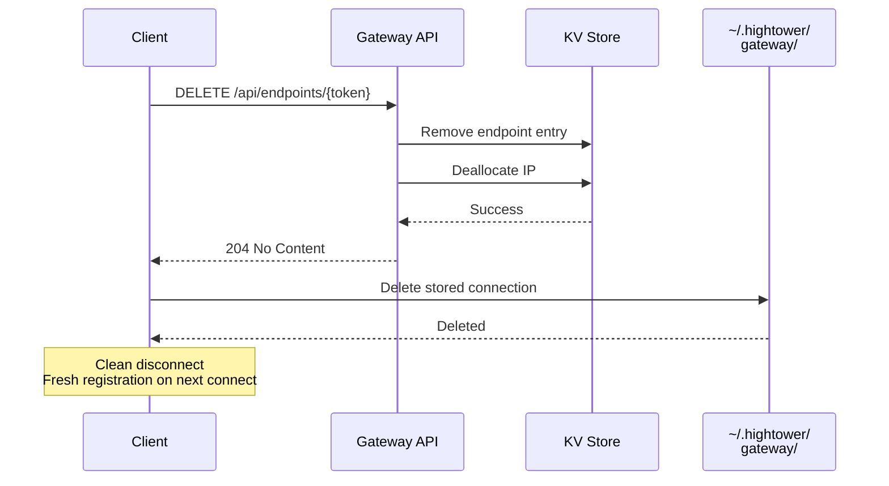

# Hightower Architecture

This document provides a comprehensive overview of the Hightower system architecture, component relationships, and key data flows.

## Table of Contents
- [System Overview](#system-overview)
- [Component Architecture](#component-architecture)
- [Network Topology](#network-topology)
- [Data Flows](#data-flows)
- [Port Usage](#port-usage)

## System Overview

Hightower is a WireGuard-based network overlay system that enables secure peer-to-peer communication through a central gateway. It consists of several interconnected components that work together to provide:

- **Secure connectivity**: WireGuard-based encryption with Noise_IK handshake
- **NAT traversal**: STUN-based public IP/port discovery
- **Peer discovery**: Gateway-mediated peer information exchange
- **Identity persistence**: Stable endpoint IDs across restarts
- **Key-value storage**: Embedded KV store for gateway state

## Component Architecture

### Component Descriptions

#### hightower-client
**Purpose**: High-level library for connecting to Hightower gateways and establishing peer-to-peer connections.

**Key Responsibilities**:
- WireGuard keypair generation and management
- Gateway registration and deregistration
- Network discovery via STUN
- Connection persistence (stores keys locally)
- Peer information retrieval and dialing
- Transport abstraction

**Location**: `client/`

#### hightower-wireguard
**Purpose**: Custom implementation of WireGuard's Noise_IK cryptographic handshake protocol.

**Key Responsibilities**:
- Noise_IK handshake (initiator and responder)
- Session key derivation (HKDF)
- ChaCha20-Poly1305 encryption/decryption
- X25519 key exchange
- Replay protection
- UDP transport layer (Connection/Stream)
- Automatic session rekeying

**What's NOT included**: TUN/TAP interfaces, IP routing, cookie mechanism (DoS protection)

**Location**: `wireguard/`

#### hightower-gateway
**Purpose**: Central coordination service that manages endpoint registration and peer discovery.

**Key Responsibilities**:
- HTTP/HTTPS API for endpoint management
- IP address allocation (typically 100.64.0.0/10 range)
- Endpoint registration/deregistration
- Peer information lookup (by endpoint ID or IP)
- WireGuard peer management
- Web-based management console
- ACME/Let's Encrypt certificate automation
- Authentication via API keys

**Ports**:
- `:8008` - HTTP API (default)
- `:51820` - WireGuard UDP

**Location**: `gateway/`

#### hightower-kv
**Purpose**: Embedded key-value store used by the gateway for state persistence.

**Key Responsibilities**:
- Log-structured storage with compaction
- In-memory hash index + radix trie for prefix queries
- Snapshot support for fast recovery
- Authentication service (user/API key management)
- Argon2 password hashing
- AES-GCM envelope encryption for metadata

**Storage Strategy**:
- Append-only log segments
- Bloom filters for cold lookups
- Background compaction
- Copy-on-write index rebuilding

**Location**: `kv/`

#### hightower-stun
**Purpose**: STUN client and server for NAT traversal and public IP discovery.

**Key Responsibilities**:
- RFC 8489 STUN implementation
- Public IP/port detection
- Binding request/response handling
- Server for providing STUN services to clients

**Port**: `:3478` (STUN server)

**Location**: `stun/`

#### hightower-naming
**Purpose**: Human-friendly endpoint ID generation.

**Key Responsibilities**:
- Generates readable IDs like `ht-festive-penguin-abc123`
- Format: `ht-{adjective}-{noun}-{random-suffix}`
- Configurable suffix length and custom prefixes

**Location**: `naming/`

#### hightower-mdns
**Purpose**: Multicast DNS for local network peer discovery.

**Key Responsibilities**:
- RFC 6762 mDNS implementation
- Service announcement and discovery
- Local network peer detection

**Location**: `mdns/`

#### hightower-node
**Purpose**: Standalone service that connects to a gateway and maintains a persistent presence.

**Key Responsibilities**:
- Connects using hightower-client
- Stores gateway URL and auth token in context
- Provides ping verification
- Handles connection lifecycle

**Location**: `node/`

#### hightower-cli (ht)
**Purpose**: Command-line interface for interacting with Hightower services.

**Commands**:
- `ht gateway` - Start a gateway server
- `ht node` - Run a node service
- `ht stun-server` - Run a STUN server
- `ht stun-client` - STUN client for IP discovery
- `ht curl` - Make HTTP requests over WireGuard

**Location**: `cli/`

## Network Topology

### Virtual IP Allocation

The gateway allocates private IPs from the `100.64.0.0/10` range (carrier-grade NAT range):
- `100.64.0.1` - Reserved for gateway
- `100.64.0.2+` - Assigned to endpoints

Each endpoint receives:
- **Endpoint ID**: Human-readable identifier (e.g., `ht-festive-penguin-abc123`)
- **Assigned IP**: Virtual IP on the WireGuard network (e.g., `100.64.0.5`)
- **Registration Token**: Used for deregistration
- **Gateway Public Key**: For establishing WireGuard tunnel to gateway

## Data Flows

### 1. Client Registration Flow

**Key Points**:
- Client binds to `0.0.0.0:0` to get an OS-assigned random port
- STUN discovery uses the **actual bound port** for accurate NAT detection
- Registration includes public endpoint for NAT traversal
- Connection info is persisted for stable identity across restarts
- WireGuard tunnel to gateway is established for control plane connectivity

### 2. Peer-to-Peer Connection Flow

**Key Points**:
- Peer lookup can use endpoint ID or assigned IP
- Gateway provides peer's public key and public endpoint
- Client automatically adds peer to WireGuard configuration
- Connection uses peer's **assigned IP** (virtual network address)
- Data flows directly between peers (P2P), not through gateway
- NAT traversal happens automatically via public endpoint information

### 3. Connection Restoration Flow

**Key Points**:
- Stored keys provide stable identity across restarts
- No re-registration needed with gateway
- Same endpoint ID and assigned IP are retained
- Only network info (public IP/port) is rediscovered
- Storage is deleted only on explicit `disconnect()`

### 4. Deregistration Flow

## Port Usage

### Gateway
- **8008** (TCP) - HTTP API (default, configurable)
- **8443** (TCP) - HTTPS API (when TLS enabled)
- **51820** (UDP) - WireGuard tunnel endpoint

### STUN Server
- **3478** (UDP) - STUN binding requests

### Clients
- **Random** (UDP) - WireGuard transport (OS-assigned ephemeral port)

### Environment Variables

#### Gateway
- `HT_AUTH_KEY` - Authentication key for API access (required)
- `HT_DEFAULT_USER` - Admin username (default: `admin`)
- `HT_DEFAULT_PASSWORD` - Admin password (default: `admin`)
- `RUST_LOG` - Log level (e.g., `debug`, `info`)

#### Client Applications
- `HT_AUTH_TOKEN` - Auth token for gateway registration
- `HT_GATEWAY_URL` - Gateway URL (default: `http://127.0.0.1:8008`)

## Storage Locations

### Gateway
- KV store: Configured via `--kv` flag or defaults to temp directory
- TLS certificates: `./certs/` (when ACME enabled)

### Client
- Connection persistence: `~/.hightower/gateway/{gateway_host}/connection.json`
- Format includes: endpoint_id, token, private_key, gateway_public_key, assigned_ip, timestamps

## Key Design Decisions

### Why WireGuard?
- Modern, audited cryptography (Noise_IK)
- High performance (in-kernel on Linux)
- Simple protocol (compared to IPsec/OpenVPN)
- Built-in roaming support for mobile devices

### Why Custom WireGuard Implementation?
- No TUN/TAP required (userspace sockets only)
- Full control over handshake timing
- Easier to embed in applications
- Portable across platforms without kernel modules

### Why Gateway-Mediated Discovery?
- Centralized peer directory simplifies discovery
- Gateway enforces authentication
- Easier than distributed DHT for small networks
- Single source of truth for IP allocation

### Why STUN for IP Discovery?
- Lightweight (single UDP request/response)
- Works with most NAT types
- Industry standard (RFC 8489)
- Can use public STUN servers or self-hosted

### Why Connection Persistence?
- Stable identity across application restarts
- Reduces gateway load (no re-registration)
- Maintains peer connectivity (same IP/ID)
- Better user experience (consistent endpoint IDs)

## Security Model

### Trust Boundaries
1. **Client ↔ Gateway**: Mutual authentication via API key (HTTP) + WireGuard handshake
2. **Client ↔ Peer**: WireGuard encryption with gateway-verified public keys
3. **Gateway ↔ KV Store**: Local (same process, no network boundary)

### Threat Model Assumptions
- Gateway is trusted authority for peer discovery
- Clients trust gateway to provide correct peer public keys
- API keys protect against unauthorized registration
- WireGuard provides confidentiality and integrity for all tunnels
- Physical security of gateway host is maintained

### What's Protected
- All peer-to-peer traffic (encrypted via WireGuard)
- Gateway API access (requires authentication)
- Stored passwords (Argon2 hashed)
- User metadata (AES-GCM encrypted)

### What's NOT Protected
- Endpoint metadata (endpoint IDs, assigned IPs are not secret)
- Connection timing/metadata (traffic analysis possible)
- DoS attacks on gateway (no rate limiting implemented yet)
- Gateway compromise (single point of failure)

## Future Architecture Considerations

### Planned Enhancements
- **KV Replication**: Multi-node KV cluster for gateway high availability
- **Gateway Clustering**: Multiple gateway instances with shared state
- **mDNS Integration**: Local peer discovery without gateway
- **NAT Hole Punching**: Improved P2P connectivity for symmetric NATs
- **Connection Pooling**: Reuse WireGuard sessions across multiple streams

### Scalability Limits
- **Single Gateway**: Limited by KV store write throughput (~0.2-0.5M ops/s)
- **IP Allocation**: Current range supports ~4M endpoints (100.64.0.0/10)
- **Peer Discovery**: O(1) lookups via KV index (fast even at scale)

## Related Documentation

- [Client README](./client/README.md) - Client library usage
- [Gateway README](./gateway/README.md) - Gateway configuration
- [WireGuard README](./wireguard/README.md) - WireGuard implementation details
- [KV README](./kv/README.md) - Key-value store architecture
- [STUN README](./stun/README.md) - STUN implementation
- [TROUBLESHOOTING.md](./TROUBLESHOOTING.md) - Common issues and solutions
