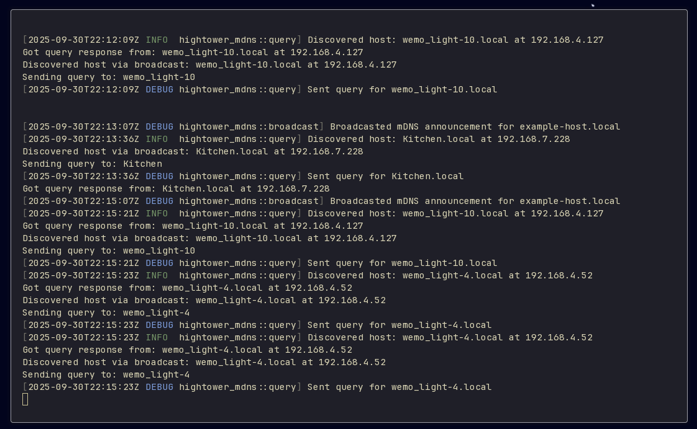

# hightower-mdns

A naive Rust implementation of mDNS (Multicast DNS) for advertising and discovering hostnames on a local network. Implements basic functionality from RFC 6762.

## Features

- Advertise a hostname on the local network with automatic periodic broadcasting
- Listen for and respond to mDNS queries from other peers
- Query for specific hostnames
- Configurable broadcast intervals
- Configurable domain (defaults to `.local` per RFC 6762)
- Channel-based API for receiving discoveries and query responses
- Async/await support with Tokio

## Installation

Add this to your `Cargo.toml`:

```toml
[dependencies]
hightower-mdns = "0.1.3"
tokio = { version = "1", features = ["rt", "rt-multi-thread", "macros"] }
```

## Usage

### Basic Example

```rust
use hightower_mdns::Mdns;
use std::net::Ipv4Addr;

#[tokio::main]
async fn main() -> std::io::Result<()> {
    // Create an mDNS instance with your hostname and local IP
    let mdns = Mdns::new("myhost", Ipv4Addr::new(192, 168, 1, 100))?;

    // Run the mDNS service (broadcasts and listens for queries)
    // Returns a handle for querying and receiving notifications
    let mut handle = mdns.run();

    // Handle incoming discoveries and responses
    loop {
        tokio::select! {
            Some(response) = handle.discoveries.recv() => {
                println!("Discovered: {} at {}", response.hostname, response.ip);
            }
            Some(response) = handle.responses.recv() => {
                println!("Query response: {} at {}", response.hostname, response.ip);
            }
        }
    }
}
```



### Querying for Hosts

```rust
use hightower_mdns::Mdns;
use std::net::Ipv4Addr;

#[tokio::main]
async fn main() -> std::io::Result<()> {
    let mdns = Mdns::new("myhost", Ipv4Addr::new(192, 168, 1, 100))?;
    let mut handle = mdns.run();

    // Query for a specific host
    handle.query("otherhost").await;

    // Wait for response
    if let Some(response) = handle.responses.recv().await {
        println!("Found: {} at {}", response.hostname, response.ip);
    }

    Ok(())
}
```

### Query on Discovery

```rust
use hightower_mdns::Mdns;
use std::net::Ipv4Addr;

#[tokio::main]
async fn main() -> std::io::Result<()> {
    let mdns = Mdns::new("myhost", Ipv4Addr::new(192, 168, 1, 100))?;
    let mut handle = mdns.run();

    loop {
        tokio::select! {
            Some(response) = handle.discoveries.recv() => {
                println!("Discovered: {} at {}", response.hostname, response.ip);

                // Query the discovered host
                let host = response.hostname.split('.').next().unwrap_or(&response.hostname);
                handle.query(host).await;
            }
            Some(response) = handle.responses.recv() => {
                println!("Query response from: {} at {}", response.hostname, response.ip);
            }
        }
    }
}
```

### Custom Domain

```rust
use hightower_mdns::Mdns;
use std::net::Ipv4Addr;

#[tokio::main]
async fn main() -> std::io::Result<()> {
    // Use a custom domain instead of .local
    let mdns = Mdns::new("myhost", Ipv4Addr::new(192, 168, 1, 100))?
        .with_domain("custom");

    let _handle = mdns.run();

    // Service is now running in the background
    tokio::time::sleep(tokio::time::Duration::from_secs(60)).await;

    Ok(())
}
```

### Goodbye Packets

```rust
use hightower_mdns::Mdns;
use std::net::Ipv4Addr;

#[tokio::main]
async fn main() -> std::io::Result<()> {
    let mdns = Mdns::new("myhost", Ipv4Addr::new(192, 168, 1, 100))?;

    // Manually send goodbye packet before leaving
    mdns.goodbye().await;

    Ok(())
}
```

## How mDNS Works

Multicast DNS (mDNS) enables DNS-like hostname resolution on a local network without requiring a conventional DNS server. It's designed for zero-configuration networking, where devices can discover each other automatically.

### Key Concepts

**Multicast Group**: mDNS uses IP multicast address 224.0.0.251 on UDP port 5353. All mDNS-enabled devices on the local network join this multicast group to send and receive DNS queries and responses.

**Domain**: By default, mDNS uses the `.local` top-level domain. Hostnames like `myhost.local` are resolved via mDNS rather than traditional DNS servers.

**DNS Record Types**: mDNS primarily uses standard DNS record types:
- **A records**: Map hostnames to IPv4 addresses
- **AAAA records**: Map hostnames to IPv6 addresses (not implemented in this library)

### Protocol Operation

**Announcements (Unsolicited Responses)**: When a device joins the network or periodically thereafter, it multicasts DNS response packets announcing its hostname and IP address. This allows other devices to learn about it without explicitly querying. Announcements are sent with the cache-flush bit set to indicate that receivers should update their cache.

**Queries**: When a device wants to find a specific hostname, it sends a DNS query to the multicast group. All devices receive the query and check if it matches their hostname.

**Responses**: If a device's hostname matches a received query, it responds with a DNS answer packet containing its IP address. Responses can be sent either via multicast (so all devices can update their caches) or via unicast (directly to the querier).

**Cache Coherency**: mDNS records have TTL (Time To Live) values. Devices cache responses and use the TTL to determine when cached data expires. The cache-flush bit in responses signals that old cached data should be replaced.

**Goodbye Packets**: When a device is about to leave the network gracefully, it sends a multicast announcement with TTL=0, signaling to other devices that they should remove its entry from their cache.

### Implementation in This Library

1. **Broadcasting**: The service periodically broadcasts your hostname and IP address to the mDNS multicast group (224.0.0.251:5353)
2. **Listening**: Simultaneously listens for mDNS queries and announcements from other peers
3. **Responding**: When a query is received for your hostname, automatically responds with your IP address
4. **Discovery**: When broadcasts from other hosts are received, sends them to the `discoveries` channel
5. **Querying**: Can send queries to discover specific hosts, responses arrive on the `responses` channel

## RFC 6762 Implementation Status

### Implemented
- Periodic announcements/broadcasts
- Query and response handling
- A record (IPv4) support
- DNS packet formatting
- Multicast address 224.0.0.251 on port 5353
- Default broadcast interval of 120 seconds
- Cache-flush bit in responses
- Goodbye packets (TTL=0) when leaving the network

### Not Implemented
- Probing (Section 8.1) - name conflict detection before claiming
- Conflict resolution
- Known-Answer Suppression
- Negative responses
- IPv6 support (AAAA records)
- TTL-based cache management
- Multiple questions/answers per packet
## License

[Add your license here]
- Truncation handling
- DNS compression pointer handling in queries

